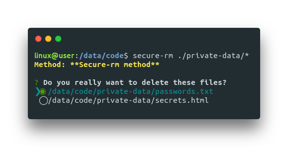
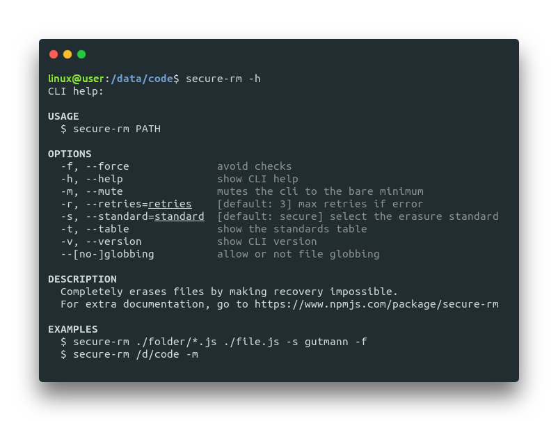

<h1 align="center">
  
  <br>
  Completely erases files by making recovery impossible.
  <br>
</h1>

<p align="center">
  <a href="https://www.npmjs.com/package/secure-rm-cli"></a>
  <a href="https://www.npmjs.com/package/secure-rm-cli"></a>
  <a href="https://github.com/oganexon/secure-rm-cli/blob/master/LICENSE"></a>
</p>
<p align="center">
  <a href="https://travis-ci.org/oganexon/secure-rm-cli"></a>
  <a href="https://travis-ci.org/oganexon/secure-rm-cli"></a>
  <a href="https://coveralls.io/github/oganexon/secure-rm-cli"></a>
  
</p>

## ❓ Why

When you delete a file using the `rm` command or `fs.unlink` in node, it only remove direct pointers to the data disk sectors and make the data recovery possible with common software tools.

Permanent data erasure goes beyond basic file deletion commands, which:
1. Allow for selection of a specific standard, based on unique needs, and
2. Verify the overwriting method has been successful and removed data across the entire device.

## 📦 Install

This package is the command line interface version of _secure-rm_. To install it, run:

```shell
npm install secure-rm-cli -g
```

Looking for the **npm module version**? See:
<a href="https://www.npmjs.com/package/secure-rm"></a>.

Secure-rm will retry 3 times if an error occur to ensure the task succeeded.

## 🚀 Getting started

If you want to delete files on the fly with a pass of cryptographically strong pseudo-random data, run:
```shell
secure-rm ./your-folder/*.js
```

When you submit files, secure-rm asks you if you are sure:

<p align="center">
  
</p>

And then you get a complete log of what happened:

<p align="center">
  
</p>

## 📚 Usage

```shell
secure-rm <PATHS> [OPTIONS]
```
- `PATHS`:
  - one or multiple paths (e.g. `D:\data /d/data ./data/file.js ../../data`)
  - supports [glob patterns](https://www.npmjs.com/package/glob#glob-primer) (e.g. `./*.js ./**/* @(pattern|pat*|pat?erN)`)
- `OPTIONS` (flags):
  - `-f, --force`: avoid checks if you want to use it in a shell or bash file;
  - `-h, --help`: show CLI help, see below;
  - `-m, --mute`: mutes the cli to the bare minimum, just the end messages;
  - `-s, --standard`: text ID of the standard, default is `secure`. See them detailed below;
  - `-r, --retries`: max retries if an error occur;
  - `-t, --table `: show the standards table. See them detailed below;
  - `-v, --version `: show CLI version;
  - `--no-globbing `: disable file globbing.

Example:
```shell
secure-rm ./folder/*.js ./file.js -s gutmann -f
```
You can invoke the built-in help with `secure-rm -h`:

<p align="center">
  
</p>

## Standards

ID | Name | Passes | Description
-- | ---- | ------ | -----------
 randomData | Pseudorandom data | 1 | Also kwown as "Australian Information Security Manual Standard ISM 6.2.92"<br>and "New Zealand Information and Communications Technology Standard NZSIT 402" <br>Your data is overwritten with cryptographically strong pseudo-random data. (The data is indistinguishable from random noise.)
 randomByte | Pseudorandom byte | 1 | Overwriting with a random byte.
 zeroes | Zeroes | 1 | Overwriting with zeroes.
 ones | Ones | 1 | Overwriting with ones.
 secure | **Secure-rm standard** | 3 | Pass 1: Overwriting with random data;<br>Pass 2: Renaming the file with random data;<br>Pass 3: Truncating between 25% and 75% of the file.
 GOST_R50739-95 | Russian State Standard GOST R 50739-95 | 2 | Pass 1: Overwriting with zeroes;<br>Pass 2: Overwriting with random data.
 HMG_IS5 | British HMG Infosec Standard 5 | 3 | Also known as "Air Force System Security Instructions AFSSI-5020",<br>"Standard of the American Department of Defense (DoD 5220.22 M)"<br>"National Computer Security Center NCSC-TG-025 Standard"<br>and "Navy Staff Office Publication NAVSO P-5239-26"<br>Pass 1: Overwriting with zeroes;<br>Pass 2: Overwriting with ones;<br>Pass 3: Overwriting with random data as well as verifying the writing of this data.
 AR380-19 | US Army AR380-19 | 3 | Pass 1: Overwriting with random data;<br>Pass 2: Overwriting with a random byte;<br>Pass 3: Overwriting with the complement of the 2nd pass, and verifying the writing.
 VSITR | Standard of the Federal Office for Information Security (BSI-VSITR)| 7 | Also known as "Royal Canadian Mounted Police TSSIT OPS-II"<br>Pass 1: Overwriting with zeroes;<br>Pass 2: Overwriting with ones;<br>Pass 3-6: Same as 1-2;<br>Pass 7: Overwriting with a random data as well as review the writing of this character.
 schneier | Bruce Schneier Algorithm | 7 | Pass 1: Overwriting with zeros;<br>Pass 2: Overwriting with ones;<br>Pass 3-7: Overwriting with random data.
 pfitzner | Pfitzner Method | 33 | Pass 1-33: Overwriting with random data.
 gutmann | Peter Gutmann Algorithm | 35 | Pass 1-4: Overwriting with random data;<br>Pass 5: Overwriting with 0x55;<br>Pass 6: Overwriting with 0xAA;<br>Pass 7-9: Overwriting with 0x92 0x49 0x24, then cycling through the bytes;<br>Pass 10-25: Overwriting with 0x00, incremented by 1 at each pass, until 0xFF;<br>Pass 26-28: Same as 7-9;<br>Pass 29-31: Overwriting with 0x6D 0xB6 0xDB, then cycling through the bytes;<br>Pass 32-35: Overwriting with random data.

Note: Node ensures that the file is correctly written, checking the writing in these algorithms is unnecessary. (Report this if I'm wrong)

## 🚩 Troubleshooting / Common issues

Should works on OS X, Linux (almost, see below), and Windows. (See build status)

### File systems

secure-rm will only work on file systems that overwrite blocks in place.

List of known file systems that will not work:
- ext3
- ext4
- AthFS – AtheOS
- OneFS
- ssd's at large
- reiserfs
- ...
- especially on the vast majority of
journaled file systems.

### "WARN Too many open files, cannot ...:"

Don't worry, you've just submited too much file for Node.
The tool will retry 3 times to ensure the task succeeded.
While you don't get an error, the tool can handle this issue.

If you really need to delete millions of file in one time, split the task (e.g. ./your_folder/a* then ./your_folder/b* ...).

### Using Windows:

Be sure to use `secure-rm ".\path\file"` with doublequotes since back-slashes will always be interpreted as escape characters, not path separators.

Another solution is to double the back-slashes like: `secure-rm .\\path\\file`

Or if you can, use forward slashes!

## 📜 Changelog

See the [changelog](/CHANGELOG.md) or [releases](https://github.com/oganexon/secure-rm-cli/releases).

## 📌 TODO

- [ ] Implement more tests

## 🏗 Contributing

<p align="center">
  <a href="https://jestjs.io"></a>
  <a href="https://www.npmjs.com"></a>
  <a href="https://nodejs.org"></a>
  <a href="https://www.typescriptlang.org/"></a>
</p>
<p align="center">
  
  
  
</p>

See [contributing guidelines](/CONTRIBUTING.md)

### Licensing

This project is under [MIT License](/LICENSE).
